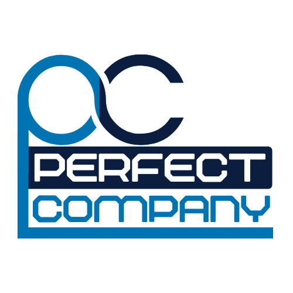

# Welcome to Perfect Company Code Repository

Hello fellow developers! This repository contains the source code and related resources for projects developed by Perfect Company's programming team.

## About Us

At Perfect Company, we are passionate about creating high-quality software solutions that address real-world challenges. Our programming team is dedicated to delivering efficient, scalable, and maintainable code.

## Getting Started

1. Clone this repository: `git clone https://github.com/perfectcompany/code-repo.git`
2. Navigate to specific project folders for detailed instructions.
3. Reach out for help: If you encounter any issues or have questions, feel free to contact our development team at [devsupport@perfectcompany.az](mailto:devsupport@perfectcompany.az).

## Contributing

We welcome contributions from the developer community! If you'd like to contribute to any of our projects, follow these steps:
1. Fork the repository.
2. Create a new branch: `git checkout -b feature/your-feature-name`
3. Make your changes and commit: `git commit -am 'Add some feature'`
4. Push to your branch: `git push origin feature/your-feature-name`
5. Open a pull request with a detailed description of your changes.

## Contact

- Website: [https://www.perfectcompany.az](https://www.perfectcompany.az)
- Developer Support: [devsupport@perfectcompany.az](mailto:devsupport@perfectcompany.az)

---
© 2017 Perfect Company Programming Team. All code is released under the MIT License.
